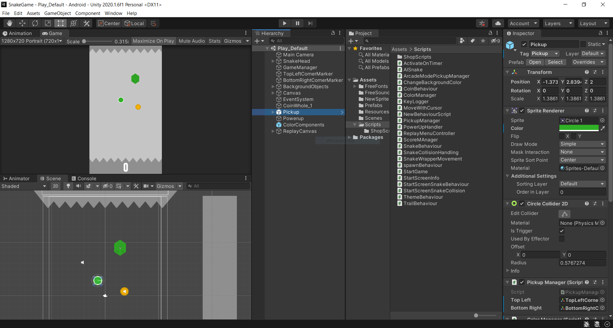

The Snake Game
===

One day in programming class, I was messing around with a computer so slow, it couldn't even run task manager without freezing. I managed to entertain myself for an embarrasingly long amount of time just by creating long trails of window after images around the desktop. Naturally, I decided to make this fun little mechanic into its own game and thus, *Snake Game* was born.

I made this right at the beginning of my coding journey, sometime in year 12, and if you have a look at the code you can definitely tell. It would be years before I knew what the S in SOLID stood for but it was fun nonetheless to have a whole stack of Manager classes pulling in dependencies from every corner of the game. I’ve thought about reviving this project a few times but I’ve settled on letting it stand as a historical monument, marking the conception of my development pathway.

