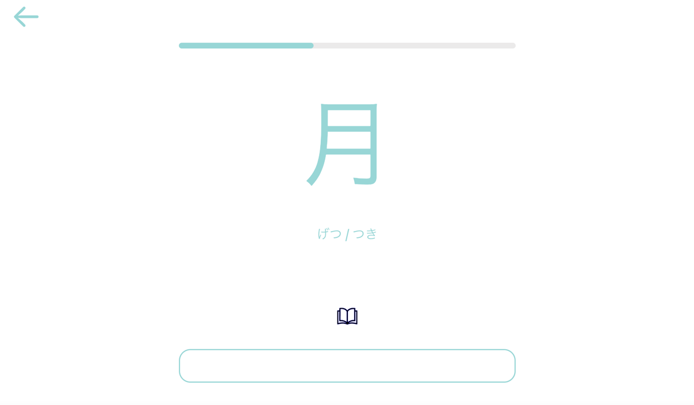

Hello World Language Learning
===
When I served as a missionary in the Philippines, I fell in love with the whole process of learning new languages and connecting with new cultures and ideas. Since then I’ve been itching for the perfect tool to enhance my language study. This tool is designed for those that recognise that learning a language takes a lot of work, this will just make the work you put in 10x more effective.

I’ve downloaded too many apps and signed up to too many services only to be disappointed again and again. One of the worst feelings is being asked again and again what ‘hola’ means in English. Not to mention being given all the answers as soon as you encounter something slightly challenging.

My biggest gripes with current language learning tools is the dominant focus on providing motivation. Slogans like “you won’t even know you’re learning” honestly frighten me. If it doesn’t feel like you’re learning, chances are you’re not. My dream tool does away with all the gimmicky motivational tools that block you from actually just digging in and learning something new. Any motivation you feel while using this tool will come only from how much progress you make from the time you put in.

Language learning, especially in the beginning stage, is all about input. You learn the rules, see how things fall into place, then you shove a whole bunch of new stuff into your head. It’s crucial to apply all the new gained knowledge in practical concepts to build strong connections and comfort in utilising words and phrases in real conversation but for now, this app is focused on stage I. From not in your head to in your head, feel free to do with it what you will.

It’s true, everyone learns differently and I could never anticipate what would work best for each user, so, I’ve just provided a framework for establishing progression.