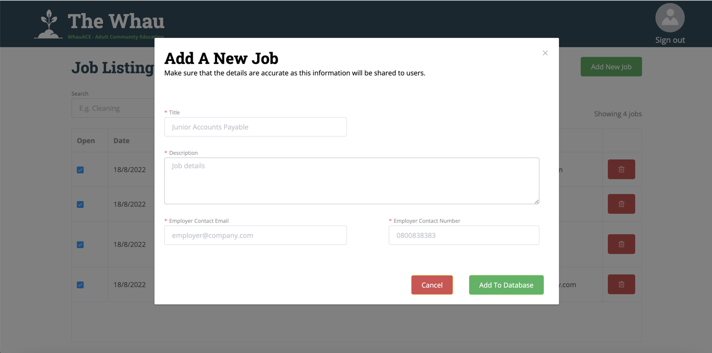

WhauACE
===

Theresa and the amazing people at WhauACE are doing an amazing job of helping people throughout West Auckland to change their circumstances through employment. It's been a great privilege to work alongside them in developing an app to boost their effectiveness.

The vision of the app is to connect job-seekers with relevant employement opporunities as well as to help the WhauACE establish a more direct link with those they work with so that their hands on work has greater impact.

A simple design was a priority as many of the target user group are not very tech savvy. To allow the staff at WhauACE to manage the content posted on the app, collect user statistics and manage their notifications an admin website was also developed.

The website and application are connected through Firebase services. 