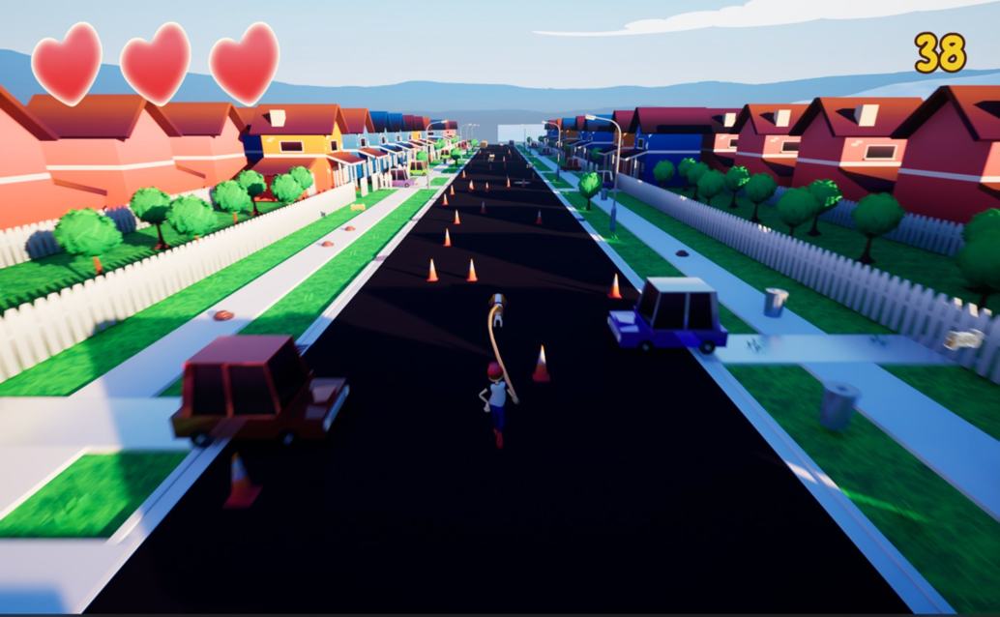

Dog Onleashed
===

Honestly, I very rarely play video games, but when a couple of old high school friends reached out to invite me to participate in the KiwiJam 2022 games hackathon, I couldn’t have been more keen. As with any hackathon, once groups are formed, the theme of the weekend is revealed and then contestants have 48 hours to put together a team. We had the great opportunity to work with a couple of amazing artists, a proactive game producer and a solid sound guy. Not to mention a couple of members from the great development team over at prismatic studios[https://prismaticstudios.co.nz].

It was a great chance to get more familiar with Unreal Engine 5 and a way to apply my programming knowledge in a new context. Honestly though, it was just great to see everybody working their craft. From 3D artists to Unreal Developers, everyone pooled their skills to create a solid final result.

With the theme: Together, the team got runner up for style with our game - Dog Onleashed. A cute endless runner where you play as a dog dragging his surprisingly fit owner behind him. Check it out for yourself at https://tomshepnz.itch.io/dog-onleashed 