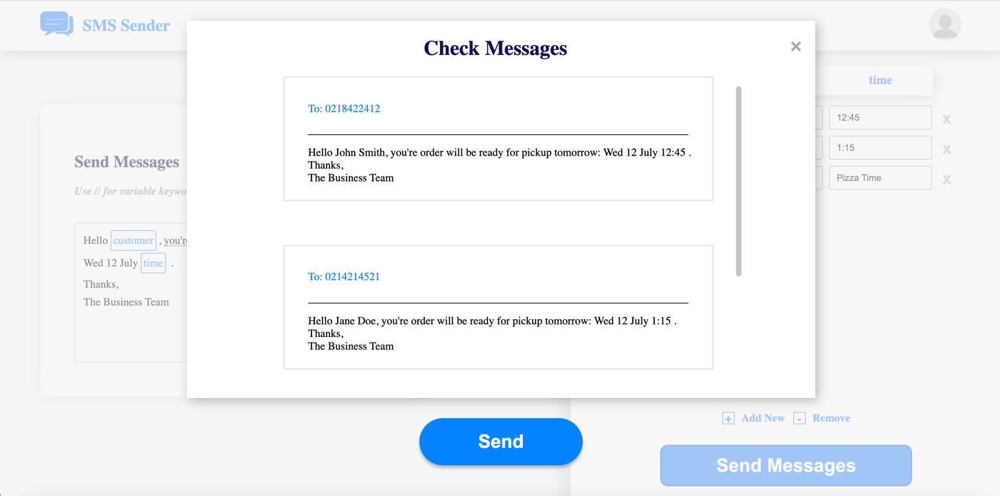

Bulk Personal SMS
===

This webapp was a quick prototype for a business concept a friend approached me with. He worked at a retail store where employees would spend up to an hour of their day sending personal messages to their customers, notfiying them of their alloted pickup times. They would copy from a template and insert the customers name and pickup time. This was a prime candidate for automation.

We put a lot of time into researching potential methods for delivering SMS from a webapp. Popular user engagement tools like at https://www.twilio.com/ had extremely high rates for NZ numbers, around 10c per text. This meant we had to determine a new method of SMS delivery. For a long term solution I was relatively confident that we would be able to set up our own SMS gateway to handle requests from the webapp. For a shortterm solution and to prove the concept we settled on using https://textfoo.com/, a service that allowed an android phone to act as an SMS gateway.

With the technology in place we were able to create an application that would actually deliver unlimited bulk personalised SMS within the price range of a single mobile plan.  

