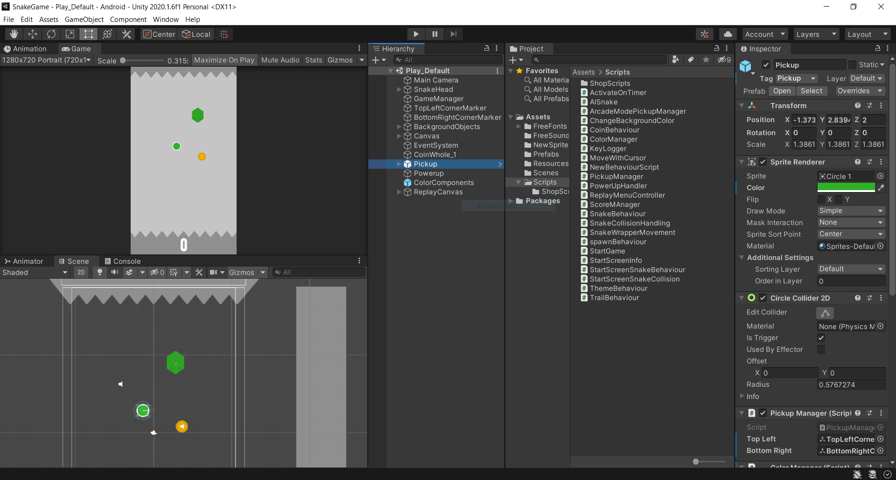

The Snake Game
===

One day in programming class I was messing around with a computer so slow that it couldn't even run task manager without freezing. I managed to entertain myself for an embarrasingly long amount of time just by creating long trails of window after images around the desktop. Naturally, I decided to make this fun little mechanic into its own game and thus, *Snake Game* was born.

>Important piece of information  
>Followed by more important information

Development
---

This game was developed in Unity, using C# as the main scripting language.

